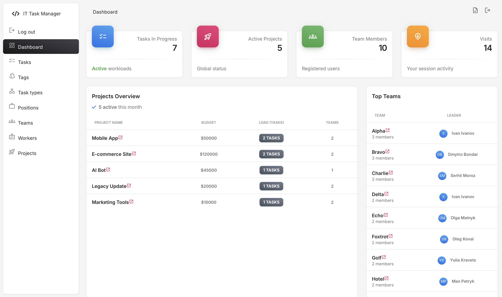

# Task & Project Manager
> A powerful, multi-purpose management system designed to organize workflows, track project budgets, and coordinate team efforts.

Whether you're running an IT agency, a marketing firm, or a creative studio, this tool provides the structure you need to manage complex projects with ease.

## Installing / Getting started

To get the project up and running on your local machine, follow these steps:

```shell
  # Clone the repository
  git clone [https://github.com/Anton924/it-company.git](https://github.com/Anton924/it-company.git)
  cd it-company
    
  # Set up virtual environment
  python3 -m venv venv
  source venv/bin/activate
    
  # Install dependencies
  pip install -r requirements.txt
    
  # Run migrations and start server
  python3 manage.py migrate
  python3 manage.py runserver
```

Once the server is running, the application will be available at:  
**[http://127.0.0.1:8000/](http://127.0.0.1:8000/)**

> **Note:** Access to the dashboard and task management requires authentication.

### Initial Configuration & Demo Data

You can choose one of the two following ways to start:

#### Option 1: Quick Start (With Demo Data)
Use this if you want to see how the system works with pre-filled projects, tasks, tags, task types, positions and teams.

1. **Load the demo database:**
```shell
  python3 manage.py loaddata data_for_tables.json
```

2. **Login with these credentials:**

* Username: admin

* Password: 1234

#### Option 2: Clean Setup
Use this if you want to build your own organizational structure from scratch.

1. **Create your own administrator:**
```shell
  python3 manage.py createsuperuser
```

2. Follow the prompts to set your own username and password, then log in to start creating Positions, 
Tasks, Tags, Task Types, Teams, and Projects.

## Developing

To start developing or adding new features, follow the standard Django workflow. 
The project structure is organized as follows:

* it_company/ — Main configurations for project (settings).

* task_manager/ — Main application logic (models, views, forms, urls etc.).

* templates/ — Global HTML templates, including custom breadcrumbs.

* templatetags/ — Custom filters like query_transform.py for dynamic URL parameters.

* static/ - Static files (CSS, images etc.).

### Testing
The project includes a comprehensive test suite. Before submitting changes, run:
```shell
  python3 manage.py test
```
Tests are located in `task_manager/tests/` and cover models, views, forms, and admin logic.

> **Note:** If you want to add your own tests, please put them in a separate file within the tests/ directory
> (e.g., test_new_feature.py) to maintain the project structure.

### Code Quality
We use `Flake8` for linting. You can check your code style by running:
```shell
  flake8 .
```
But It can take some time, so It will be easier check specific directory.  
For exemple:
```shell
  # Example: Check only the models file
  flake8 task_manager/models.py

  # Example: Check the project settings
  flake8 it_company/settings.py
```

### Building

If you modify the data structure in `task_manager/models.py`, you must update the database schema:

```shell
  python3 manage.py makemigrations
  python3 manage.py migrate
```

These commands will detect your changes in Python models and create/apply corresponding 
SQL commands to update the `db.sqlite3` database file.

### Deploying / Publishing

1. To prepare the project for a production environment:

Collect static files:

```shell
  python3 manage.py collectstatic
```

2. Set in the environment variables DJANGO_SETTINGS_MODULE=it_company.settings.prod

## Features

This Task Manager provides a structured approach to workflow organization, moving from high-level planning to individual execution.

* **Project & Budget Tracking:** Manage multiple projects simultaneously. Monitor their current status (In Process, Done, Paused, Canceled) and keep track of financial budgets assigned to each initiative.
    
* **Team-Based Collaboration:** Organize workers into specialized **Teams**. Each team can have a designated **Team Lead**, ensuring clear accountability and leadership within the organizational structure.

* **360° Worker Overview:** Gain full visibility into your workforce. Each **Worker profile** displays not only their assigned tasks but also a comprehensive list of **Teams** they belong to, making it easy to track cross-team involvement.

* **Granular Task Management:** Create detailed tasks with specific **Types** (e.g., Bug, Feature, Refactoring) and dynamic **Tags**. Assign tasks to multiple team members and set clear deadlines.

* **Priority Matrix:** Never miss what's important. Use the built-in priority system (Critical, High, Medium, Low) to visualize and tackle the most urgent issues first.

* **Mobile-First Design:** The entire interface is **fully responsive** and optimized for mobile devices. Manage your projects and track tasks on the go, whether you are using a smartphone, tablet, or desktop.

* **Intuitive UI/UX:** A clean dashboard built with **Bootstrap 5**, featuring breadcrumb navigation for easy movement between complex project layers and team structures.

* **Automated Workflow:** New tasks automatically receive a 10-day deadline by default, helping to maintain a steady development pace without manual input for every field.

## Configuration

Settings are primarily located in it_company/settings.py.

#### SECRET_KEY
Type: `String`  
Default: `Django generated.`
Used for security. **Always change this for production.**

#### DEBUG
Type: `Boolean`  
Default: `True`.

Set to False in production to hide sensitive error details.
## Contributing

"If you'd like to contribute, please fork the repository and use a feature branch. Pull requests are warmly welcome."

## Links

- Project homepage: 
- Repository: [https://github.com/Anton924/it-company](https://github.com/Anton924/it-company)
- Issue tracker: [https://github.com/Anton924/it-company/issues](https://github.com/Anton924/it-company/issues)
  - In case of sensitive bugs like security vulnerabilities, please contact
    `yakovenkoanton2007@gmail.com` directly instead of using issue tracker. I value your effort
    to improve the security and privacy of this project!

## Demo  




## Licensing

The code in this project is licensed under the **MIT License**.  
For the full legal text, please refer to the [LICENSE](LICENSE) file located in the root directory of this repository.
